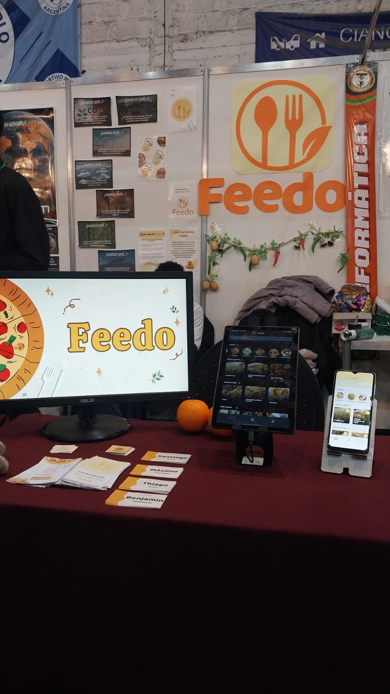
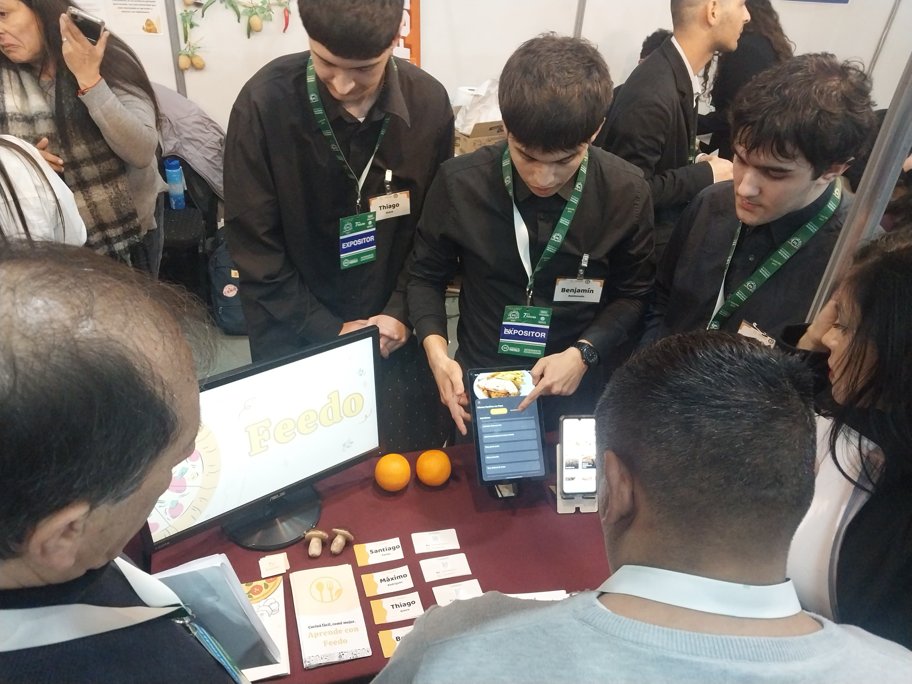
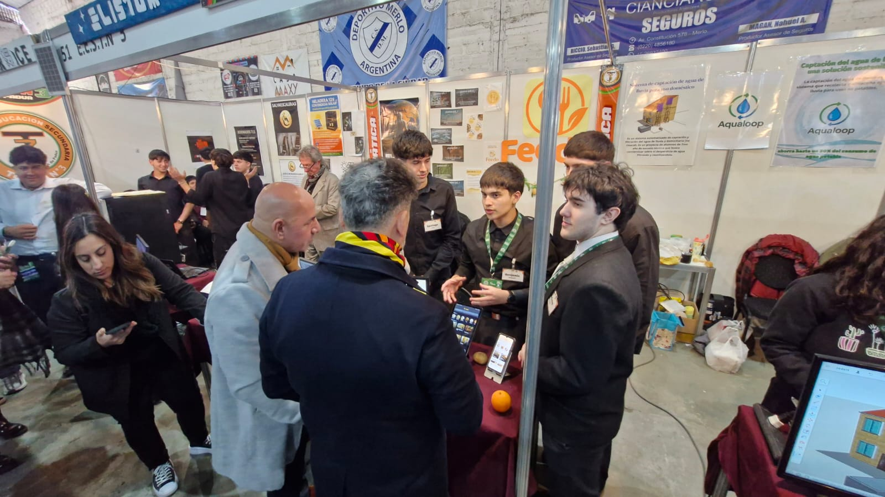
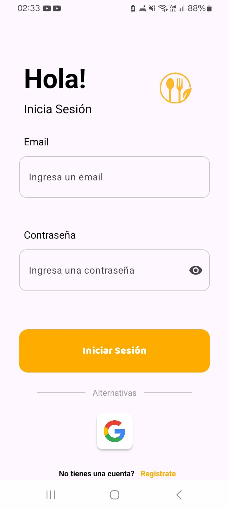
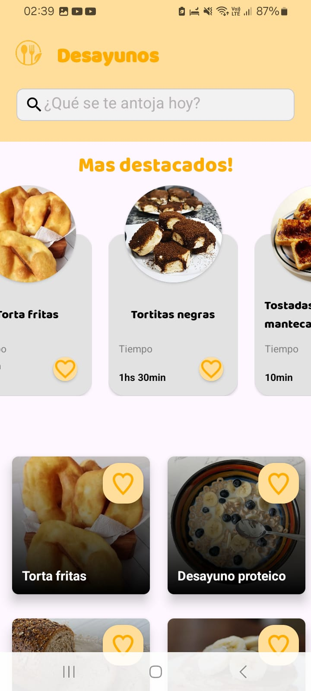
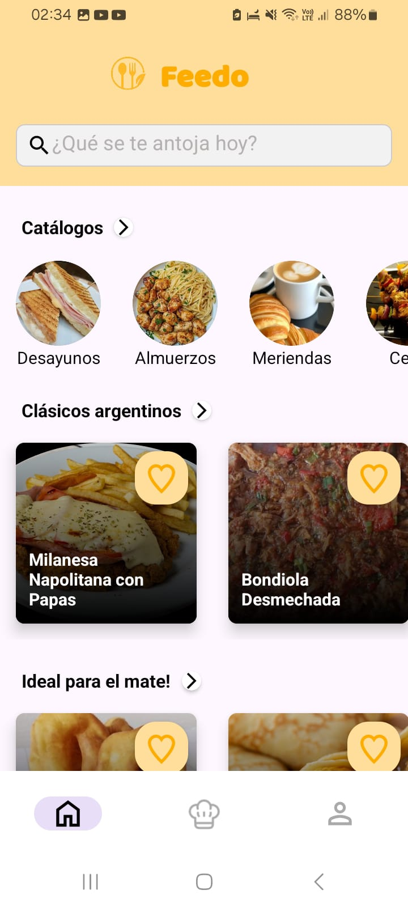
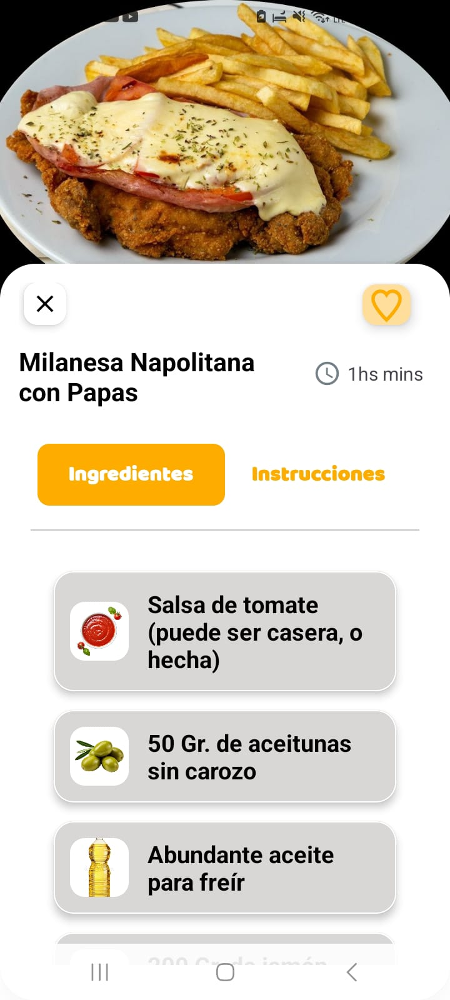
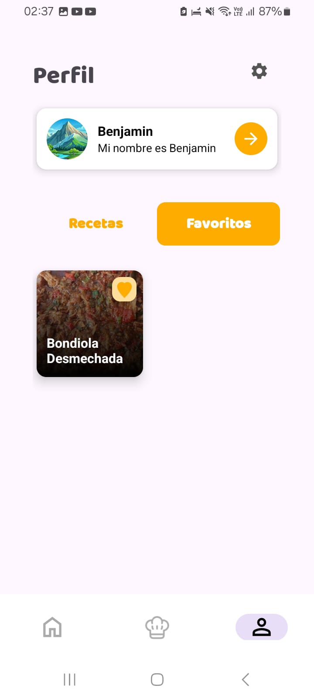
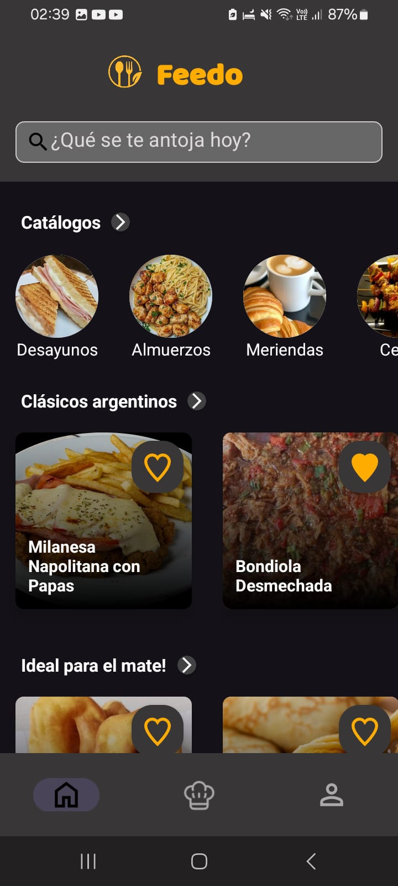

# 🥗 Feedo — Android MVP (2025)

> **Proyecto Final Integrador — Técnico en Informática**  
> *Seleccionado para representar a la E.E.S.T. N°3 en la Expo "Hecho en Merlo".*

Feedo es una aplicación móvil para Android orientada a la exploración de recetas y descubrimiento gastronómico. Fue desarrollada desde cero en 2025 como proyecto final de la carrera técnica de nivel secundario.

Actualmente, este repositorio preserva el código fuente original del MVP en su versión 2025.

---

## 🏛️ Reconocimiento (Expo Hecho en Merlo)

El proyecto fue seleccionado por la **Escuela de Educación Secundaria Técnica N°3** para representar a la institución en la feria oficial **[Hecho en Merlo](https://www.merlo.gob.ar/hechoenmerlo/)**.

Durante la exposición, la aplicación contó con un stand interactivo donde los visitantes, evaluadores y el Intendente del municipio pudieron probar el MVP en vivo y realizar consultas sobre su viabilidad de producción y lanzamiento al público.

### 📸 Galería de la Presentación

| Stand de Exposición | Presentación a Evaluadores | Explicación al Intendente |
| :---: | :---: | :---: |
|  |  |  |
---

## 🚀 Funcionalidades Principales

- 🔐 **Autenticación & Sesiones:** Registro e inicio de sesión tradicional con verificación de email y soporte para Google Sign-In.
- 📂 **Categorías de Comida:** Clasificación organizada para una navegación intuitiva.
- 🔍 **Exploración de Recetas:** Buscador y visualización detallada de ingredientes y pasos.
- ⭐ **Favoritos:** Guardado de recetas preferidas por usuario en tiempo real.
- 👤 **Secciones Personalizadas:** Gestión de perfil y preferencias dentro de la app.

---

## 🛠️ Stack Tecnológico Original

* **Lenguaje:** Kotlin
* **Arquitectura:** MVVM (Model-View-ViewModel) y Clean Architecture
* **Inyección de Dependencias:** Hilt
* **Interfaz:** Android SDK (XML Layouts, ViewBinding, Fragments)
* **BaaS & Persistencia:** Supabase (Auth, Database)
* **IDE:** Android Studio

---

## 📱 Capturas de Pantalla de la App

| Inicio de Sesión | Categorías | Pantalla Principal |
| :---: | :---: | :---: |
|  |  |  |

| Detalle de Receta | Perfil de Usuario | Modo Oscuro |
| :---: | :---: | :---: |
|  |  |  |

---

## 🎯 Propósito de este Repositorio

Este repositorio conserva deliberadamente la implementación original del 2025 como un registro histórico de mi punto de partida técnico.

Próximamente se estará encarando un **Reboot / Modernización** en un repositorio independiente para llevar el proyecto a estándares de producción actuales (Jetpack Compose, Backend propio con Python/PostgreSQL y arquitectura limpia).

## 📥 Descarga la App

Podés descargar e instalar el archivo APK directamente en tu dispositivo Android para probar el MVP original:

*(Nota: Al ser una versión de prueba fuera de Google Play Store, es posible que Android requiera habilitar la opción "Instalar aplicaciones de fuentes desconocidas").*